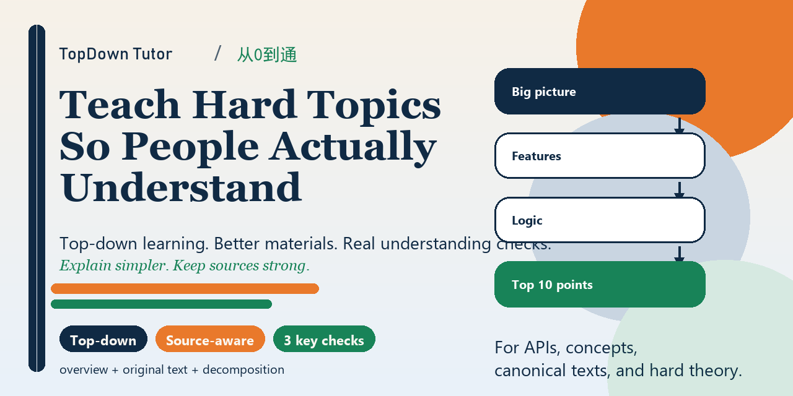

# TopDown Tutor

<p align="center">
  
</p>

[](./LICENSE)
[](https://github.com/televgtamfe-coder/topdown-tutor/releases)
[](./skills/knowledge-coach/SKILL.md)

[简体中文](./README.zh-CN.md)

Teach hard topics so people actually understand them.

TopDown Tutor is a reusable learning skill for agent-driven teaching. It gathers the right materials, teaches from the top down, and checks whether the learner truly got it instead of stopping at "here is an explanation."

If most learning prompts feel too shallow, too random, or too dependent on the learner doing all the searching first, this project is built to fix exactly that.

## 30-Second Tour

- Start with a plain-language understanding, then deepen layer by layer.
- Keep source authority high instead of quietly downgrading the material.
- Teach in a fixed rhythm: overall picture, distinctive features, internal logic, top 10 knowledge points.
- Support overview + original text + decomposition for canonical-text topics.
- Ask up to three key checks instead of scattering many questions.
- Give one simple example for every new knowledge point.
- Translate technical or English terms on first mention with the original term, the Chinese translation, and a plain Chinese explanation.

## Why People Share It

- It does not only explain. It combines material gathering, structured teaching, and understanding checks in one flow.
- It works across very different topic types: APIs, concepts, historical ideas, and canonical texts.
- It makes the explanation easier without lowering the authority level of the source.
- Its output shape is stable enough to reuse as a skill, an agent workflow, or a teaching standard for a team.

## Quick Start

GitHub CLI `gh 2.90.0+` is recommended for public installation.

Install for Codex at user scope:

```bash
gh skill install televgtamfe-coder/topdown-tutor knowledge-coach --agent codex --scope user
```

Preview before install:

```bash
gh skill preview televgtamfe-coder/topdown-tutor knowledge-coach
```

Install from a local checkout:

```bash
gh skill install D:\topdown-tutor knowledge-coach --from-local --dir C:\Users\MeetYou\.codex\skills --force
```

Optional Codex plugin packaging lives in `plugins/topdown-tutor`.

## Launch Kit

- [Social preview copy](./docs/launch/social-preview-copy.md)
- [GitHub release copy](./docs/launch/github-release-copy.md)
- [Demo script](./docs/launch/demo-script.md)

## What You Get in One Session

- a one-sentence topic definition
- a zero-start overview breakdown when the learner's starting point is unclear
- the overall picture first
- the distinctive features next
- the internal logic after that
- the top 10 most important knowledge points
- one simple example for every new point
- first-mention term support for technical or English wording
- up to three key comprehension checks
- one role- or environment-specific application when learner context is known

## Teaching Rhythm

Every topic follows the same top-down order:

1. Zero-start overview when needed
2. Overall picture
3. Distinctive features
4. Internal logic
5. Top 10 knowledge points
6. Key checks

Each point is explained in three layers:

1. Plain-language understanding
2. Accurate everyday explanation
3. More technical explanation

## How It Gets Materials

TopDown Tutor does not treat every topic the same.

- Library, framework, API, and tool topics prefer official documentation, official examples, and other primary references.
- Broad concept topics prefer textbooks, review material, and reputable educational sources.
- Historical, political, intellectual, or canonical-text topics prefer overview material plus direct source material plus decomposition notes.
- Applied topics prefer worked examples and practice tasks.

The core rule is simple:

**Make the explanation easier. Do not lower the authority level of the source unless the learner explicitly asks for that.**

## Canonical-Text Mode

When a topic has important original texts, TopDown Tutor keeps both routes:

1. Overview
2. Original text
3. Decomposition

That gives the learner orientation first, contact with the source second, and support for breaking the source into:

- historical context
- core claim
- plain-language meaning
- important terms
- why the text matters
- common misunderstandings

This avoids two common failures:

- staying forever at summary level
- throwing raw original text at the learner without support

## Copy-Paste Prompts

```text
Teach me what an API is from the top down. Gather the right materials and check whether I really understood it.
```

```text
Teach me React Hooks from the top down. Keep it easy to understand, but do not downgrade the source level.
```

```text
Teach me probability from the top down with examples and key checks.
```

```text
Teach me The Art of War as a canonical-text topic using overview + original text + decomposition.
```

```text
Teach me a political or historical idea from the top down. Use overview + original text + decomposition when the topic has canonical texts, and keep the explanation plain without lowering source authority.
```

## Good Fits

This skill works especially well for topics that are easy to oversimplify or overcomplicate:

- technical topics such as APIs or React Hooks
- concept-heavy topics such as probability
- canonical-text topics such as *The Art of War*
- theory-heavy topics that need both overview and source contact

## Example Topics

Ready-made examples live in [`examples/`](./examples):

- [`api.md`](./examples/api.md)
- [`react-hooks.md`](./examples/react-hooks.md)
- [`probability.md`](./examples/probability.md)
- [`the-art-of-war.md`](./examples/the-art-of-war.md)

## Output Shape

The standard output shape is:

1. One-sentence topic definition
2. Overall map
3. Distinctive features
4. Internal logic
5. Top 10 knowledge points
6. One simple example for each new point
7. Term translation support on first mention
8. Up to three key checks

For canonical-text topics it also includes:

1. Overview sources
2. Original text picks
3. Decomposition path

## Repository Structure

```text
topdown-tutor/
|- .agents/
|  `- plugins/
|     `- marketplace.json
|- assets/
|- docs/
|  `- launch/
|- examples/
|- plugins/
|  `- topdown-tutor/
`- skills/
   `- knowledge-coach/
      |- SKILL.md
      |- agents/
      `- references/
```

## FAQ

### Does "plain-language understanding" mean child-level source material?

No. It means the explanation should be easier to understand. It does not mean the sources should be child-oriented or lower in authority.

### Does it ask too many questions?

No. Each round stays focused to up to three key checks.

### Does it support original texts?

Yes. That is one of the core design choices of the project.

### Is it only for technical topics?

No. It also works for concept-heavy, theoretical, historical, and canonical-text topics.

## Contributing

Issues, examples, README improvements, and packaging fixes are all welcome.

When contributing, keep these rules stable:

- plain-language explanation first
- no silent source downgrade
- overview + original text + decomposition for canonical-text topics
- up to three key checks per round
- one simple example for every new knowledge point

## License

This project is licensed under the MIT License. See [`LICENSE`](./LICENSE).

## Real Session Example (Chinese)

This transcript is intentionally kept in Chinese because the value is not only the content, but also the tightening rhythm of the teaching interaction.

> Assistant: 我先按你是想问“毛泽东思想”来讲。
>
> Assistant: 如果把它用最通俗的方式讲，它就是：把马克思列宁主义的基本原理，放到中国当时的实际情况里去用，不是照抄，而是“按中国的地，种中国的庄稼”。
>
> Assistant: 你先试着用一句话说说看：毛泽东思想最核心的一点，你现在觉得是什么？
>
> User: 马列主义在中国当时情况下的应用，是因为是一套思想体系。
>
> Assistant: 很接近。我帮你压得更准一点：毛泽东思想，是把马克思列宁主义同中国具体实际结合起来形成的一套思想体系。
>
> Assistant: 如果把它再压缩成 4 个字，你觉得最重要的方法味道像什么？
>
> User: 实事求是。
>
> Assistant: 对。那你再用自己的话说说，什么叫“实事求是”？
>
> User: 从实际出发 靠研究弄清情况再决定方针。
